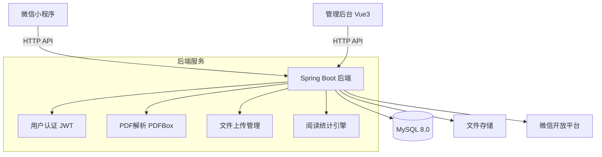
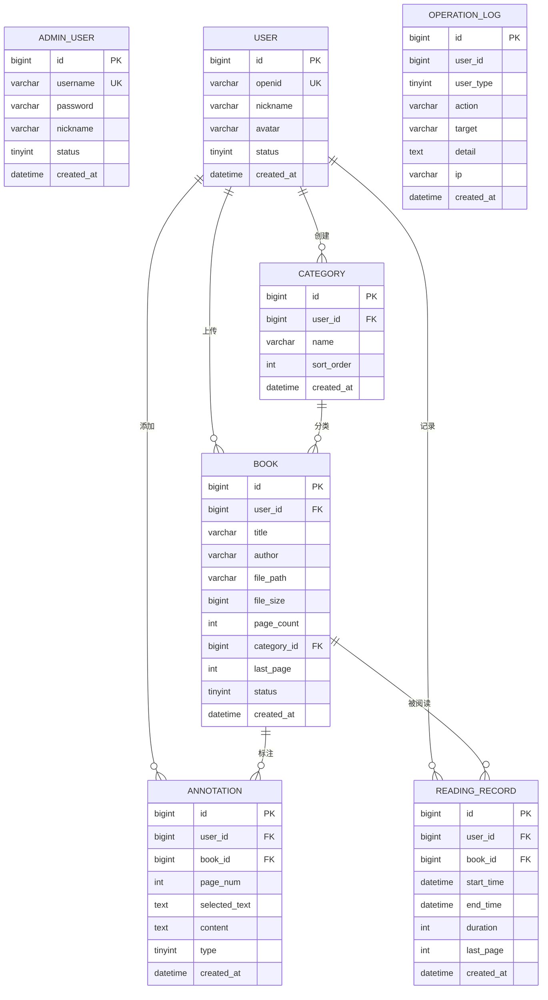

# 小安的书店 - 项目设计文档

## 1. 系统架构

## 2. ER 图

## 3. 接口清单

### 3.1 管理后台接口 (AdminController)

| 方法 | 路径 | 说明 |
|------|------|------|
| POST | /api/admin/login | 管理员登录 |
| GET | /api/admin/dashboard | 仪表盘统计 |
| GET | /api/admin/users | 用户列表 |
| PUT | /api/admin/users/{id}/status | 修改用户状态 |
| GET | /api/admin/books | 书籍列表 |
| GET | /api/admin/logs | 操作日志 |

### 3.2 小程序用户接口 (MpUserController)

| 方法 | 路径 | 说明 |
|------|------|------|
| POST | /api/mp/login | 微信登录 |
| GET | /api/mp/user/profile | 获取用户信息 |
| PUT | /api/mp/user/profile | 修改用户信息 |

### 3.3 小程序书籍接口 (MpBookController)

| 方法 | 路径 | 说明 |
|------|------|------|
| POST | /api/mp/books/upload | 上传PDF |
| GET | /api/mp/books | 我的书籍列表 |
| GET | /api/mp/books/{id} | 书籍详情 |
| DELETE | /api/mp/books/{id} | 删除书籍 |
| GET | /api/mp/books/{id}/page/{pageNum} | 获取PDF页面图片 |
| GET | /api/mp/books/{id}/toc | 获取PDF目录 |
| POST | /api/mp/categories | 新建分类 |
| GET | /api/mp/categories | 分类列表 |
| PUT | /api/mp/categories/{id} | 修改分类 |
| DELETE | /api/mp/categories/{id} | 删除分类 |

### 3.4 小程序批注接口 (MpAnnotationController)

| 方法 | 路径 | 说明 |
|------|------|------|
| POST | /api/mp/annotations | 添加批注 |
| GET | /api/mp/annotations | 批注列表 |
| PUT | /api/mp/annotations/{id} | 修改批注 |
| DELETE | /api/mp/annotations/{id} | 删除批注 |

### 3.5 小程序阅读接口 (MpReadingController)

| 方法 | 路径 | 说明 |
|------|------|------|
| POST | /api/mp/reading/start | 开始阅读 |
| POST | /api/mp/reading/end | 结束阅读 |
| GET | /api/mp/reading/summary | 阅读统计 |
| GET | /api/mp/reading/history | 阅读历史 |

## 4. UI/UX 规范

### 4.1 主色调

| 用途 | 色值 | 说明 |
|------|------|------|
| 主色 | #6B4226 | 书卷棕 |
| 辅色 | #D4A574 | 暖杏色 |
| 强调 | #E8734A | 活力橙 |
| 背景 | #F5F0EB | 羊皮纸白 |
| 文字 | #333333 | 深灰 |
| 辅助文字 | #999999 | 浅灰 |

### 4.2 阅读主题

| 主题 | 背景色 | 文字色 | 说明 |
|------|--------|--------|------|
| 白色 | #FFFFFF | #333333 | 默认 |
| 护眼绿 | #C7EDCC | #2D4A2D | 护眼模式 |
| 夜空黑 | #1A1A2E | #E0E0E0 | 夜间模式 |

### 4.3 字体与间距

- 标题字号：18px / 16px / 14px
- 正文字号：14px
- 辅助文字：12px
- 卡片圆角：8px
- 内边距：16px / 12px / 8px
- 卡片阴影：0 2px 12px rgba(0,0,0,0.08)
